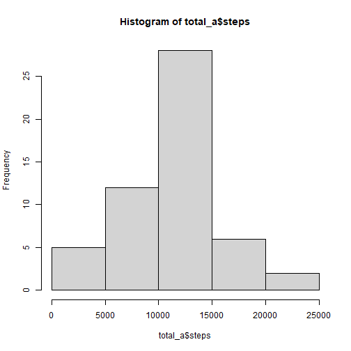
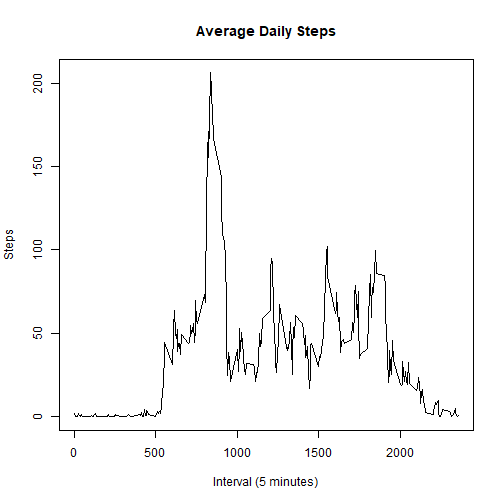
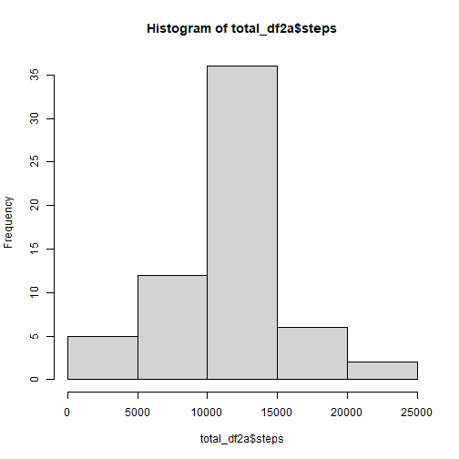
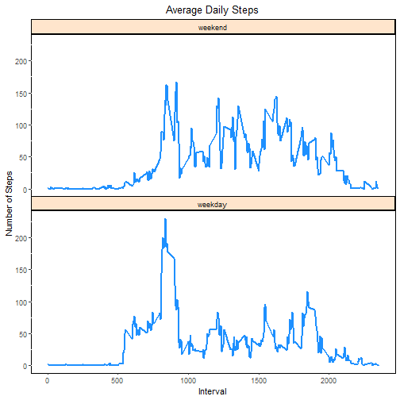

## Loading and preprocessing the data
1. Load the data from the local directory.
  
  ```r
  df <- read.csv("activity.csv")
  ```

2. Process/transform the data (if necessary) into a format suitable for analysis.
  
  ```r
  total_a <- aggregate(steps ~ date, df, sum)
  mean_a <- aggregate(steps ~ interval, df, mean)
  ```

## What is mean total number of steps taken per day?

1. Make a histogram of the total number of steps taken each day.
  
  ```r
  hist(total_a$steps)
  ```
  
  

2. Calculate and report the mean and median total number of steps taken per day.
  
  ```r
  mean(total_a$steps)
  ```
  
  ```
  ## [1] 10766.19
  ```
  
  ```r
  median(total_a$steps)
  ```
  
  ```
  ## [1] 10765
  ```

## What is the average daily activity pattern?
1. Make a time series plot (i.e. `type = "l"`) of the 5-minute interval (x-axis) 
and the average number of steps taken, averaged across all days (y-axis)
  
  ```r
  plot(x = mean_a$interval, y = mean_a$steps, type="l", 
       main = "Average Daily Steps",
       xlab = "Interval (5 minutes)", 
       ylab = "Steps")
  ```
  
  

2. Which 5-minute interval, on average across all the days in the dataset, 
contains the maximum number of steps?
  
  ```r
  mean_a[which.max(mean_a$steps), 1] 
  ```
  
  ```
  ## [1] 835
  ```

## Imputing missing values
1. Calculate and report the total number of missing values in the dataset (i.e. the total number of rows with `NAs`)
  
  ```r
  count_na <- sum(is.na(df$steps))
  count_na
  ```
  
  ```
  ## [1] 2304
  ```

2. Devise a strategy for filling in all of the missing values in the dataset. The strategy does not need to be sophisticated. For example, you could use the mean/median for that day, or the mean for that 5-minute interval, etc.

  Imput strategy: use the mean steps for each 5-minute interval
  
  ```r
  mean_interval_steps <- aggregate(steps ~ interval, df, mean)
  ```

3. Create a new dataset that is equal to the original dataset but with the 
missing data filled in.
  
  ```r
  # merge mean interval steps with data frame to create new data frame
  df2 <- merge(df, mean_interval_steps, by = "interval", all.x = TRUE)
  
  # replace NAs with mean interval steps value
  df2$steps <- ifelse(is.na(df2$steps.x), df2$steps.y, df2$steps.x)
  ```

4. Make a histogram of the total number of steps taken each day.
  
  ```r
  total_df2a <- aggregate(steps ~ date, df2, sum)
  hist(total_df2a$steps)
  ```
  
  

  Calculate and report the mean and median total number of steps taken per day. 
  
  ```r
  mean(total_df2a$steps)
  ```
  
  ```
  ## [1] 10766.19
  ```
  
  ```r
  median(total_df2a$steps)
  ```
  
  ```
  ## [1] 10766.19
  ```

  Do these values differ from the estimates from the first part of the assignment? 

  No, not significantly.
  
  What is the impact of imputing missing data on the estimates of the total daily number of steps?
  
  Very little impact to the total daily number of steps. Only the median number changed. Average total daily steps is over 10K. Number of NAs is little over 2K. I would not expect a large change to the total number of steps.

## Are there differences in activity patterns between weekdays and weekends?
1. Create a new factor variable in the dataset with two levels -- "weekday" and "weekend" indicating whether a given date is a weekday or weekend day.
  
  ```r
  # create new column for days of the week
  df2$days <- weekdays(as.Date(df2$date))
  
  # group days into weekend/weekday
  df2$days <- replace(df2$days, df2$days %in% c("Monday", "Tuesday", "Wednesday", 
                                                "Thursday", "Friday"), "weekday")
  df2$days <- replace(df2$days, df2$days %in% c("Saturday", "Sunday"), "weekend")
  
  # calc mean for each interval and day
  mean_df2a <- aggregate(steps ~ interval + days, df2, mean)
  
  # create a factor variable to order panel plots by weekend/weekday
  mean_df2a$days_f <- factor(mean_df2a$days, levels=c("weekend", "weekday"))
  
  library(ggplot2)
  ```

2. Make a panel plot containing a time series plot (i.e. `type = "l"`) of the 5-minute interval (x-axis) and the average number of steps taken, averaged across all weekday days or weekend days (y-axis). 
  
  ```r
  ggplot(mean_df2a, aes(interval, steps)) + 
    ggtitle("Average Daily Steps") +
    theme(plot.title = element_text(hjust = 0.5), # centre text
          strip.background = element_rect(colour="black", fill="#ffe5cc", 
                                          size=1, linetype="solid"),
          panel.background = element_rect(colour="black", fill="white"),
          panel.spacing = unit(0, "lines") # reduce panel spacing
          ) + 
    xlab("Interval") +
    ylab("Number of Steps") +
    facet_wrap(~days_f, # order facets by days factor variable
               dir = "v", # split facets in vertical direction
               strip.position ="top") + # facet label on top
    geom_line(color = "dodgerblue", size = 1) 
  ```
  
  

